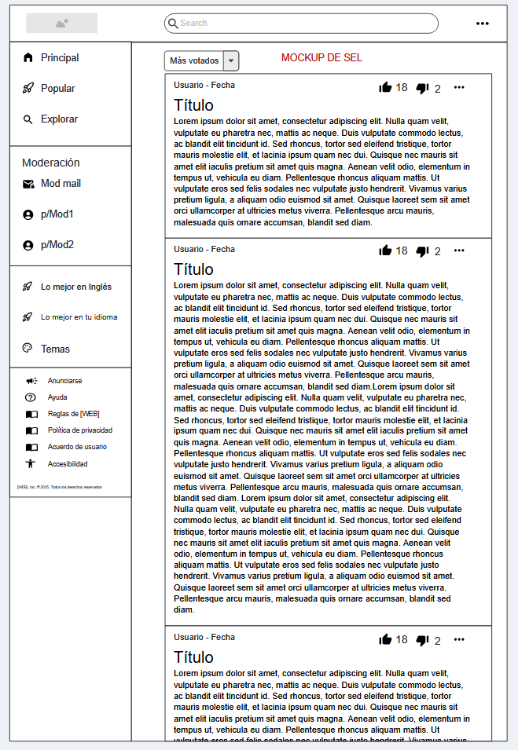
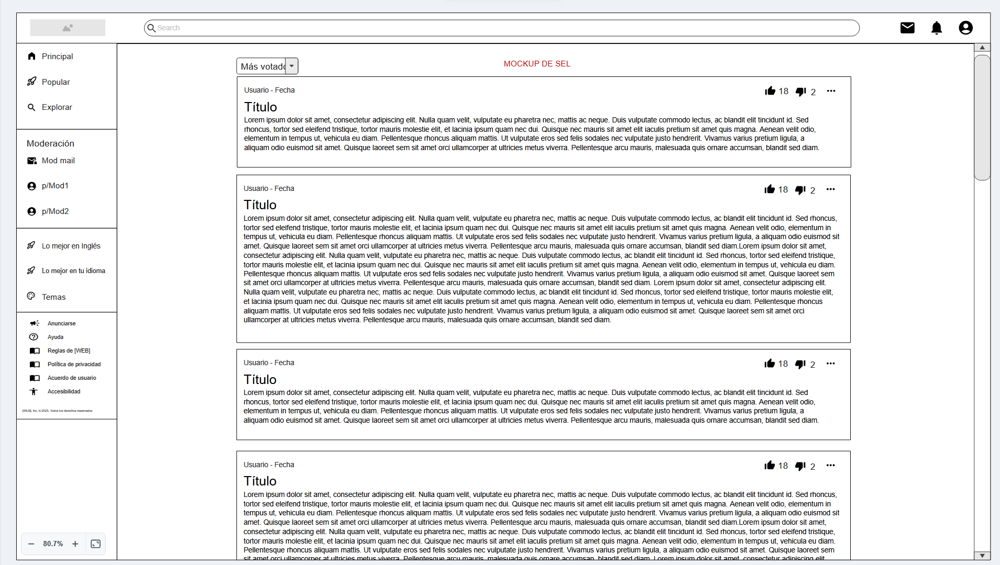

# [Uso de la aplicacion](index.html)

### Tipo de usuarios

-  Mi tio
-  Un perro
-  Cualquier ser vivo con capacidad sapiente y pulgares oponibles

### Ejemplo de tabla

| Función / Acción                | Usuario Normal | Admin           | Jefe            |
|---------------------------------|----------------|----------------|----------------|
| Ver contenido general           | ✅              | ✅              | ✅              |
| Crear contenido                 | ✅              | ✅              | ✅              |
| Editar contenido propio         | ✅              | ✅              | ✅              |
| Editar contenido de otros       | ❌              | ✅              | ✅              |
| Eliminar contenido propio       | ✅              | ✅              | ✅              |
| Eliminar contenido de otros     | ❌              | ✅              | ✅              |
| Gestionar usuarios              | ❌              | ✅              | ✅              |
| Asignar roles                   | ❌              | ✅              | ✅              |
| Aprobar proyectos / solicitudes | ❌              | ❌              | ✅              |
| Ver reportes financieros        | ❌              | ✅              | ✅              |
| Configuración del sistema       | ❌              | ✅              | ✅              |
| Acceso a estadísticas avanzadas | ❌              | ✅              | ✅              |

### Casos de uso

... no lo sé.

---

## Capturas

(Son de verdad del proyecto)

#### Mockup Móvil

#### Mockup PC

